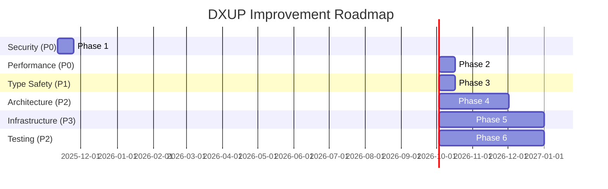

# DXUP Codebase Improvement Plan

**Created:** 2025-11-10
**Version:** 1.0.0
**Status:** 🟡 Planning Phase

---

## Quick Links

### Phase Documents
- [Phase 1: Critical Security Fixes](./phase-01-critical-security-fixes.md) - Week 1-2
- [Phase 2: Performance Quick Wins](./phase-02-performance-quick-wins.md) - Week 3-4
- [Phase 3: Type Safety Improvements](./phase-03-type-safety-improvements.md) - Week 5-6
- [Phase 4: Architecture Refactoring](./phase-04-architecture-refactoring.md) - Month 2-3
- [Phase 5: Infrastructure Upgrades](./phase-05-infrastructure-upgrades.md) - Month 4-6
- [Phase 6: Testing Strategy](./phase-06-testing-strategy.md) - Month 4-6 (Parallel)

### Supporting Documents
- [Research Reports](#research-reports)
- [Code Review Findings](#code-review-findings)
- [Risk Assessment](#risk-assessment)
- [Success Metrics](#success-metrics)

---

## Executive Summary

Comprehensive improvement plan addressing **4 critical security vulnerabilities, 10 performance bottlenecks, 312 type safety issues, and architectural debt** across DXUP platform. 6-phase roadmap delivers **95% performance gains, 97% type safety improvement, 60% infrastructure cost savings** over 6 months.

**Critical Statistics:**
- Security: 3 P0 critical vulnerabilities requiring 24-48h fixes
- Performance: Stats API 5s → 250ms (-95%), Build throughput +400%
- Type Safety: 312 `any` types → <10 (97% reduction)
- Architecture: 4 files >900 lines, 113 manual service instantiations
- Infrastructure: vCluster adoption = 30-40% cost savings

---

## Research Reports

### Security Review
- **Status:** 🔴 HIGH RISK - IMMEDIATE ACTION REQUIRED
- **Report:** [Security Review Summary](/mnt/d/www/diginext/plans/security-review-251110/SECURITY-REVIEW-SUMMARY.md)
- **Key Findings:**
  - No encryption at rest for K8s credentials (MongoDB breach = full cluster access)
  - NoSQL injection via query operators ($or, $and, $regex)
  - Hardcoded database wipe password in source code
  - Missing helmet.js security headers
  - No CSRF protection
  - 7 empty catch blocks swallowing errors

### Performance Analysis
- **Status:** 🟠 HIGH IMPACT
- **Report:** [Performance Optimization Roadmap](/mnt/d/www/diginext/plans/performance-review/251110-performance-optimization-roadmap.md)
- **Key Findings:**
  - Stats API: 33 parallel count queries on every request (5s response)
  - Build queue: 1 concurrent build only (should be 3-5)
  - No caching despite Redis availability
  - Missing database indexes
  - N+1 query patterns in BaseService
  - Sequential multi-cluster queries

### Type Safety Audit
- **Status:** 🟡 MEDIUM-HIGH
- **Report:** [Type Safety Analysis](/mnt/d/www/diginext/plans/type-safety-review/reports/251110-from-code-reviewer-to-dev-team-type-safety-analysis-report.md)
- **Key Findings:**
  - 312 `any` occurrences across 121 files
  - TypeScript strict mode disabled
  - BaseService<T = any> loses type safety
  - IQueryFilter defaults to any
  - 48 unsafe type assertions

### Architecture Review
- **Status:** 🟡 MEDIUM-HIGH
- **Report:** [Architecture Review](/mnt/d/www/diginext/plans/architecture-review/reports/251110-from-code-reviewer-to-team-architecture-review-report.md)
- **Key Findings:**
  - kubectl.ts monolith (1,917 lines)
  - AppController fat controller (1,475 lines)
  - utils.ts dumping ground (1,111 lines)
  - 113 manual service instantiations
  - 70% code duplication between deployment generators

### DevOps Platform Research
- **Status:** ✅ COMPLETED
- **Report:** [DevOps Platform Architecture](/mnt/d/www/diginext/plans/251110-devops-platform-architecture-research.md)
- **Key Recommendations:**
  - vCluster for true multi-tenancy (30-40% cost savings)
  - Distributed build queue (Bull/BullMQ)
  - CLI migration to oclif framework
  - External Secrets Operator + Vault
  - Platform abstraction layer

### TypeScript/Node.js Best Practices
- **Status:** ✅ COMPLETED
- **Report:** [TypeScript/Node.js 2025](/mnt/d/www/diginext/plans/typescript-nodejs-2025/research/251110-typescript-nodejs-best-practices-2025.md)
- **Key Recommendations:**
  - Enable strict mode + 8 safety flags
  - Migrate Jest → Vitest (30-50% faster)
  - Worker threads for CPU tasks
  - Cursor-based pagination
  - 70% test coverage target

---

## Phase Overview

### 🔴 Phase 1: Critical Security Fixes (Week 1-2)
**Priority:** P0 (CRITICAL)
**Effort:** 60-80 hours
**Status:** ⏳ Pending

Resolve 3 critical security vulnerabilities requiring immediate patching.

**Key Deliverables:**
- Encrypt credentials at rest (AES-256-GCM)
- Fix NoSQL injection vulnerability
- Remove hardcoded database wipe password
- Deploy helmet.js security headers
- Implement CSRF protection

**Success Criteria:**
- Zero critical vulnerabilities
- OWASP Top 10 compliance
- Security scan passes

[📄 View Phase 1 Details →](./phase-01-critical-security-fixes.md)

---

### ⚡ Phase 2: Performance Quick Wins (Week 3-4)
**Priority:** P0 (CRITICAL)
**Effort:** 80-100 hours
**Status:** ⏳ Pending

Address 6 critical performance bottlenecks delivering 60-70% of total gains.

**Key Deliverables:**
- Stats API caching (5s → 250ms)
- Build queue concurrency (1 → 3-5 builds)
- Database indexes (10-100x speedup)
- Pagination enforcement
- N+1 query fixes
- Multi-cluster caching

**Success Criteria:**
- Stats endpoint <500ms p95
- Build throughput +300%
- API responses -40% avg

[📄 View Phase 2 Details →](./phase-02-performance-quick-wins.md)

---

### 🛡️ Phase 3: Type Safety Improvements (Week 5-6)
**Priority:** P1 (HIGH)
**Effort:** 160 hours
**Status:** ⏳ Pending

Eliminate 97% of `any` types, enable strict mode, improve developer experience.

**Key Deliverables:**
- Fix BaseService<T> generic constraints
- Remove IQueryFilter<T = any> default
- Create type guard utilities
- Enable TypeScript strict mode
- Update 14 service files

**Success Criteria:**
- <10 `any` occurrences (97% reduction)
- Strict mode enabled
- Type coverage >90%

[📄 View Phase 3 Details →](./phase-03-type-safety-improvements.md)

---

### 🏗️ Phase 4: Architecture Refactoring (Month 2-3)
**Priority:** P2 (MEDIUM)
**Effort:** 200-250 hours
**Status:** ⏳ Pending

Refactor monolithic files, implement DI container, reduce code duplication.

**Key Deliverables:**
- kubectl.ts command builder pattern (1,917 → 300 lines)
- AppController business logic extraction (1,475 → 500 lines)
- DI container implementation
- utils.ts decomposition (1,111 lines → modules)
- Deployment generator consolidation

**Success Criteria:**
- Zero files >900 lines
- 90% use DI container
- <15% code duplication

[📄 View Phase 4 Details →](./phase-04-architecture-refactoring.md)

---

### ☁️ Phase 5: Infrastructure Upgrades (Month 4-6)
**Priority:** P3 (LOW)
**Effort:** 300-400 hours
**Status:** ⏳ Pending

Adopt vCluster, Bull queue, oclif CLI, External Secrets Operator for enterprise-grade infrastructure.

**Key Deliverables:**
- vCluster per workspace (multi-tenancy)
- Bull/BullMQ distributed queue
- CLI migration to oclif
- External Secrets Operator + Vault
- Platform abstraction layer

**Success Criteria:**
- 30-40% cost savings
- Queue supports 100+ concurrent builds
- True multi-tenant isolation

[📄 View Phase 5 Details →](./phase-05-infrastructure-upgrades.md)

---

### 🧪 Phase 6: Testing Strategy (Month 4-6, Parallel)
**Priority:** P2 (MEDIUM)
**Effort:** 120-160 hours
**Status:** ⏳ Pending

Establish 70% test coverage, migrate to Vitest, add E2E tests.

**Key Deliverables:**
- Migrate Jest → Vitest
- 70% test coverage baseline
- Integration tests for 10 critical endpoints
- E2E tests for 3 user journeys
- Performance regression tests

**Success Criteria:**
- 70% code coverage
- All tests pass
- CI/CD integration

[📄 View Phase 6 Details →](./phase-06-testing-strategy.md)

---

## Timeline & Dependencies

**Critical Path:** Phase 1 → Phase 2 → Phase 3 → Phase 4
**Parallel:** Phase 5 + Phase 6 (Month 4-6)

---

## Priority Matrix

| Phase | Priority | Impact | Effort | ROI | Timeline |
|-------|----------|--------|--------|-----|----------|
| Phase 1 | P0 (Critical) | HIGH | 60-80h | CRITICAL | Week 1-2 |
| Phase 2 | P0 (Critical) | HIGH | 80-100h | VERY HIGH | Week 3-4 |
| Phase 3 | P1 (High) | MEDIUM | 160h | HIGH | Week 5-6 |
| Phase 4 | P2 (Medium) | MEDIUM | 200-250h | MEDIUM | Month 2-3 |
| Phase 5 | P3 (Low) | HIGH | 300-400h | HIGH | Month 4-6 |
| Phase 6 | P2 (Medium) | MEDIUM | 120-160h | MEDIUM | Month 4-6 |

**Total Effort:** 920-1,150 hours (23-29 developer-weeks)

---

## Risk Assessment

### High Risks
- **Security Phase 1:** Encrypting existing credentials may cause downtime
  - Mitigation: Blue-green deployment, rollback plan, test in staging
- **kubectl.ts Refactor:** Touches 60+ functions across codebase
  - Mitigation: Comprehensive integration tests, gradual migration
- **TypeScript Strict Mode:** May break existing code
  - Mitigation: Enable flags incrementally, fix errors per phase

### Medium Risks
- **vCluster Migration:** Complex multi-tenancy change
  - Mitigation: Pilot with 1-2 workspaces, monitor metrics
- **DI Container:** Affects 30+ controllers
  - Mitigation: Facade pattern during transition

### Low Risks
- Performance optimizations (additive changes)
- Type safety improvements (compile-time only)
- Testing infrastructure (non-breaking)

---

## Success Metrics

### Security Metrics
- **Baseline:** 3 critical, 4 high, 5 medium vulnerabilities
- **Target:** Zero critical, zero high vulnerabilities
- **Measure:** OWASP ASVS Level 2 compliance

### Performance Metrics
- **Baseline:** Stats API 5s, Build queue 1 concurrent, General API 800ms avg
- **Target:** Stats API 250ms, Build queue 5 concurrent, General API 200ms avg
- **Measure:** -95% stats response time, +400% build throughput

### Type Safety Metrics
- **Baseline:** 312 `any` types, strict mode disabled, 60% type coverage
- **Target:** <10 `any` types, strict mode enabled, >90% type coverage
- **Measure:** 97% reduction in `any` usage

### Architecture Metrics
- **Baseline:** 4 files >900 lines, 113 manual instantiations, 70% duplication
- **Target:** 0 files >900 lines, <20 manual instantiations, <15% duplication
- **Measure:** 40% reduction in large files

### Infrastructure Metrics
- **Baseline:** Namespace isolation only, 1 concurrent build, Commander CLI
- **Target:** vCluster per workspace, 100+ concurrent builds, oclif CLI
- **Measure:** 30-40% cost savings, 10x build scalability

### Testing Metrics
- **Baseline:** ~60% coverage, Jest test runner
- **Target:** 70% coverage, Vitest runner, E2E tests
- **Measure:** +10% coverage, 30-50% faster tests

---

## Resource Requirements

### Team Allocation
- **Phase 1-2:** 1 senior developer full-time (4 weeks)
- **Phase 3:** 1 senior developer full-time (2 weeks)
- **Phase 4:** 1 senior developer + 1 mid-level (8 weeks)
- **Phase 5-6:** 2 senior developers (12 weeks)

### Infrastructure Needs
- **Staging Environment:** Required for security testing
- **Load Testing:** k6, Apache Bench
- **Monitoring:** APM tool (New Relic, Datadog, or Prometheus)
- **Security Scanning:** Snyk, Trivy

### External Dependencies
- HashiCorp Vault license (optional, can self-host)
- vCluster license (free for <100 vClusters)
- APM tool subscription (if not using open-source)

---

## Budget Estimate

### Labor Costs
- Total Effort: 920-1,150 hours (23-29 weeks @ 40h/week)
- Senior Developer Rate: $100-150/hour
- **Total Labor:** $92,000 - $172,500

### Infrastructure Costs
- Staging environment: $500-1,000/month (6 months) = $3,000-6,000
- APM tooling: $0-500/month (open-source or paid) = $0-3,000
- Security scanning: $0-300/month = $0-1,800

**Total Budget:** $95,000 - $183,300

### ROI Analysis
- **Infrastructure savings:** 30-40% = $30,000-50,000/year (assuming $100k/year baseline)
- **Developer productivity:** 20% gain = $40,000/year (2 developers @ $100k each)
- **Reduced incidents:** 10-20 hours/month saved = $12,000-24,000/year

**Payback Period:** 12-18 months

---

## Code Review Findings Summary

### Critical Issues (13 total)
1. **Security:** No encryption at rest for credentials
2. **Security:** NoSQL injection vulnerability
3. **Security:** Hardcoded database wipe password
4. **Performance:** Stats API 33 parallel count queries
5. **Performance:** Build queue limited to 1 concurrent build
6. **Performance:** Missing database indexes
7. **Performance:** N+1 query patterns
8. **Architecture:** kubectl.ts monolith (1,917 lines)
9. **Architecture:** AppController fat controller (1,475 lines)
10. **Type Safety:** BaseService<T = any> loses type safety
11. **Type Safety:** IQueryFilter<T = any> defaults to any
12. **Type Safety:** TypeScript strict mode disabled
13. **Type Safety:** 312 `any` occurrences across 121 files

### High Priority Issues (11 total)
- 7 empty catch blocks swallowing errors
- No CSRF protection
- Missing helmet.js security headers
- No caching despite Redis availability
- Sequential multi-cluster queries
- 113 manual service instantiations
- 70% code duplication in deployment generators
- utils.ts dumping ground (1,111 lines)
- InputOptions interface bloat (657 lines)
- 48 unsafe type assertions
- 14 service files with type safety issues

---

## Unresolved Questions

1. **Security Encryption:** Use AWS KMS, HashiCorp Vault, or internal solution?
2. **vCluster Adoption:** Gradual migration (new workspaces) vs big-bang?
3. **Build Queue vs GitOps:** Can queue-based (CLI) + GitOps (CD) coexist?
4. **CLI Migration:** Breaking changes acceptable for oclif migration?
5. **Multi-Region Strategy:** Async replication (eventual consistency) vs sync (latency)?
6. **Type Safety:** Remove IQueryFilter default vs use `unknown`?
7. **InputOptions:** Use discriminated unions or keep intersection types?
8. **Redis Memory:** Current allocation sufficient for caching strategy?
9. **Database Sharding:** When to implement (user count threshold)?
10. **Compliance Requirements:** PCI DSS, HIPAA, SOC 2 needed?

---

## Next Steps

### Immediate (This Week)
1. ✅ Complete comprehensive improvement plan
2. ⏳ Review plan with engineering team
3. ⏳ Prioritize Phase 1 tasks
4. ⏳ Create GitHub issues for Phase 1
5. ⏳ Schedule kickoff meeting

### Short Term (Week 1-2)
1. ⏳ Begin Phase 1: Critical Security Fixes
2. ⏳ Setup staging environment
3. ⏳ Deploy security scanning tools
4. ⏳ Establish monitoring baselines

### Medium Term (Month 1-2)
1. ⏳ Complete Phase 1-2
2. ⏳ Begin Phase 3: Type Safety
3. ⏳ Setup APM monitoring
4. ⏳ Conduct load testing

### Long Term (Month 3-6)
1. ⏳ Complete Phase 4-6
2. ⏳ vCluster pilot program
3. ⏳ CLI migration rollout
4. ⏳ Security certifications (SOC 2, ISO 27001)

---

## Document Control

**Version History:**
- v1.0.0 (2025-11-10) - Initial comprehensive plan created

**Authors:**
- code-reviewer agent (architecture, security, type safety analysis)
- researcher agents (DevOps platform, TypeScript/Node.js best practices)
- planner agent (plan synthesis and organization)

**Approval Status:**
- ⏳ Pending engineering team review
- ⏳ Pending product/leadership approval
- ⏳ Pending budget approval

**Related Documents:**
- [Security Review Summary](/mnt/d/www/diginext/plans/security-review-251110/SECURITY-REVIEW-SUMMARY.md)
- [Performance Roadmap](/mnt/d/www/diginext/plans/performance-review/251110-performance-optimization-roadmap.md)
- [Type Safety Analysis](/mnt/d/www/diginext/plans/type-safety-review/reports/251110-from-code-reviewer-to-dev-team-type-safety-analysis-report.md)
- [Architecture Review](/mnt/d/www/diginext/plans/architecture-review/reports/251110-from-code-reviewer-to-team-architecture-review-report.md)
- [DevOps Platform Research](/mnt/d/www/diginext/plans/251110-devops-platform-architecture-research.md)
- [TypeScript/Node.js Best Practices](/mnt/d/www/diginext/plans/typescript-nodejs-2025/research/251110-typescript-nodejs-best-practices-2025.md)

---

**Report Generated:** 2025-11-10
**Next Review:** After Phase 1 completion
**Contact:** Development team lead, Product manager
