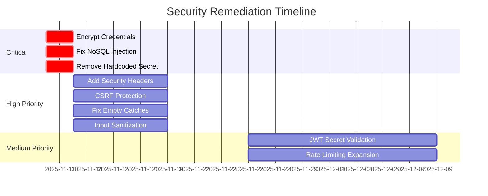

# DXUP Security Review - November 2025

**Review Date:** 2025-11-10
**Version:** 3.36.2
**Reviewer:** Code Review Agent (AI Security Auditor)
**Status:** 🔴 HIGH RISK

---

## 📋 Quick Links

| Document | Purpose | Audience |
|----------|---------|----------|
| [**Executive Summary**](SECURITY-REVIEW-SUMMARY.md) | High-level overview, key findings | Leadership, Stakeholders |
| [**Comprehensive Report**](reports/251110-security-audit-comprehensive-report.md) | Detailed technical analysis with code examples | Security Engineers, Developers |
| [**Remediation Checklist**](REMEDIATION-CHECKLIST.md) | Task tracking, assignments, timelines | Engineering Team |

---

## 🎯 At a Glance

### Risk Level: HIGH

```
┌──────────────────────────────────────────┐
│  CRITICAL:  3 issues                     │
│  HIGH:      4 issues                     │
│  MEDIUM:    5 issues                     │
│  LOW:       2 issues                     │
└──────────────────────────────────────────┘
```

### Top 3 Critical Vulnerabilities

1. **🔴 No Encryption at Rest** - Kubernetes credentials stored as plaintext in MongoDB
2. **🔴 NoSQL Injection** - Query parameters directly converted to MongoDB operators
3. **🔴 Hardcoded Secret** - Database wipe password exposed in source code

---

## 📊 Review Scope

- **Files Analyzed:** 422 TypeScript files in `/src`
- **Frameworks:** OWASP Top 10 2021, CWE/SANS Top 25
- **Focus Areas:**
  - Authentication & Authorization
  - Data Encryption & Secret Management
  - Input Validation & Injection Prevention
  - Security Headers & CSRF Protection
  - Error Handling & Logging

---

## ⏱️ Remediation Timeline



**Target Dates:**
- **Week 1 (by 2025-11-12):** 3 critical fixes deployed
- **Week 2-3 (by 2025-11-24):** 4 high priority fixes deployed
- **Month 2 (by 2025-12-10):** 5 medium priority fixes deployed

---

## 🚀 Quick Start for Engineering Team

### 1. Leadership Review
👉 Start with [**Executive Summary**](SECURITY-REVIEW-SUMMARY.md)
- Understand business impact
- Review risk prioritization
- Approve remediation timeline

### 2. Technical Review
👉 Read [**Comprehensive Report**](reports/251110-security-audit-comprehensive-report.md)
- Detailed vulnerability analysis
- Code examples and attack scenarios
- Remediation code samples
- OWASP mapping

### 3. Implementation
👉 Use [**Remediation Checklist**](REMEDIATION-CHECKLIST.md)
- Task assignments
- Implementation steps
- Test cases
- Definition of done

---

## 📁 Directory Structure

```
security-review-251110/
├── README.md                           # This file
├── SECURITY-REVIEW-SUMMARY.md          # Executive summary
├── REMEDIATION-CHECKLIST.md            # Task tracking
└── reports/
    └── 251110-security-audit-comprehensive-report.md  # Full report
```

---

## 🎯 Priority Matrix

| Issue | Severity | Effort | Impact | Priority |
|-------|----------|--------|--------|----------|
| Encrypt credentials | CRITICAL | Medium | Extreme | P0 |
| NoSQL injection | CRITICAL | Low | High | P0 |
| Hardcoded secret | CRITICAL | Low | High | P0 |
| Security headers | HIGH | Low | Medium | P1 |
| CSRF protection | HIGH | Medium | Medium | P1 |
| Input sanitization | HIGH | Medium | Medium | P1 |
| Empty catch blocks | HIGH | Low | Low | P1 |
| JWT validation | MEDIUM | Low | Medium | P2 |
| Rate limiting | MEDIUM | Low | Medium | P2 |
| Log sanitization | MEDIUM | Medium | Low | P2 |
| Body size limits | MEDIUM | Low | Low | P2 |
| Cookie hardening | MEDIUM | Low | Low | P2 |
| CORS review | LOW | Low | Low | P3 |
| Bcrypt config | LOW | Low | Low | P3 |

---

## ✅ What's Working Well

The following security controls are properly implemented:

- ✅ **Bcrypt password hashing** with 10 rounds
- ✅ **JWT authentication** properly structured
- ✅ **Soft delete pattern** prevents accidental data loss
- ✅ **Workspace isolation** enforced at query level
- ✅ **Rate limiting** active on authentication endpoints
- ✅ **Environment-based configuration** for secrets
- ✅ **MongoDB parameterized queries** (basic level)

---

## 🧪 Testing Requirements

### Before Production Deployment

**Security Testing:**
- [ ] NoSQL injection penetration testing
- [ ] XSS payload testing (OWASP ZAP)
- [ ] CSRF attack simulations
- [ ] Rate limiting stress tests
- [ ] Session hijacking scenarios
- [ ] Credential extraction attempts

**Compliance Checks:**
- [ ] OWASP ASVS Level 2 verification
- [ ] PCI DSS alignment (if applicable)
- [ ] GDPR data protection review
- [ ] SOC 2 control mapping (if pursuing certification)

---

## 💰 Investment Required

**Estimated Effort:** 3-4 weeks (1 senior security engineer or experienced backend developer)

**Breakdown:**
- **Week 1:** Critical fixes (encryption, injection, secrets)
- **Week 2-3:** High priority (headers, CSRF, sanitization, logging)
- **Month 2:** Medium priority (rate limiting, validation, hardening)
- **Ongoing:** Testing, validation, monitoring

**Tools/Services Needed:**
- [ ] HashiCorp Vault or AWS KMS (for secret management) - Optional but recommended
- [ ] Security scanning tools (Snyk, SonarQube) - Recommended
- [ ] Penetration testing services - Recommended for final validation

---

## 🔐 Security Best Practices Introduced

This review introduces industry-standard security practices:

1. **Defense in Depth:** Multiple security layers (encryption, sanitization, headers)
2. **Least Privilege:** Token-based authorization for destructive operations
3. **Secure by Default:** Fail-safe configurations, no weak fallbacks
4. **Audit Logging:** Comprehensive security event tracking
5. **Input Validation:** Whitelist approach for query parameters
6. **Output Encoding:** XSS prevention via sanitization
7. **Cryptographic Standards:** AES-256-GCM for encryption at rest

---

## 🤝 Stakeholder Communication

### For Engineering Leadership
- Review [Executive Summary](SECURITY-REVIEW-SUMMARY.md)
- Approve timeline and resource allocation
- Sign off on [Remediation Checklist](REMEDIATION-CHECKLIST.md)

### For Developers
- Study [Comprehensive Report](reports/251110-security-audit-comprehensive-report.md)
- Implement fixes per [Remediation Checklist](REMEDIATION-CHECKLIST.md)
- Attend security training if needed

### For Security Team
- Validate remediation code
- Conduct penetration testing post-fix
- Schedule follow-up audit (2025-12-10)

---

## 📞 Questions & Support

**For Technical Questions:**
- Review detailed code examples in comprehensive report
- Consult OWASP documentation for specific vulnerabilities
- Contact: code-reviewer agent

**For Process Questions:**
- Review remediation checklist for task assignments
- Escalate blockers to engineering leadership

**For Compliance Questions:**
- Map findings to your compliance framework (PCI DSS, HIPAA, SOC 2)
- Consult with legal/compliance team

---

## 📅 Key Dates

| Date | Milestone |
|------|-----------|
| 2025-11-10 | Security audit completed |
| 2025-11-12 | Critical fixes deployed (target) |
| 2025-11-24 | High priority fixes deployed (target) |
| 2025-12-10 | Medium priority fixes deployed (target) |
| 2025-12-10 | Follow-up security review |
| 2026-02-10 | Quarterly security audit |

---

## 🔄 Next Steps

1. **Immediate (Today):**
   - [ ] Distribute this review to engineering leadership
   - [ ] Schedule team meeting to discuss findings
   - [ ] Assign owners for critical tasks

2. **This Week:**
   - [ ] Begin critical vulnerability remediation
   - [ ] Set up encryption key management
   - [ ] Deploy NoSQL injection fix
   - [ ] Remove hardcoded secrets

3. **Next 2-3 Weeks:**
   - [ ] Deploy high priority fixes
   - [ ] Conduct security testing
   - [ ] Update documentation

4. **Ongoing:**
   - [ ] Monitor security logs
   - [ ] Track remediation progress
   - [ ] Schedule follow-up review

---

## 📚 References

- [OWASP Top 10 2021](https://owasp.org/Top10/)
- [OWASP Application Security Verification Standard](https://owasp.org/www-project-application-security-verification-standard/)
- [CWE Top 25 Most Dangerous Software Weaknesses](https://cwe.mitre.org/top25/)
- [NIST Cybersecurity Framework](https://www.nist.gov/cyberframework)
- [MongoDB Security Checklist](https://www.mongodb.com/docs/manual/administration/security-checklist/)

---

**Report Version:** 1.0
**Last Updated:** 2025-11-10
**Next Review:** 2025-12-10 (post-remediation)
**Contact:** code-reviewer agent
